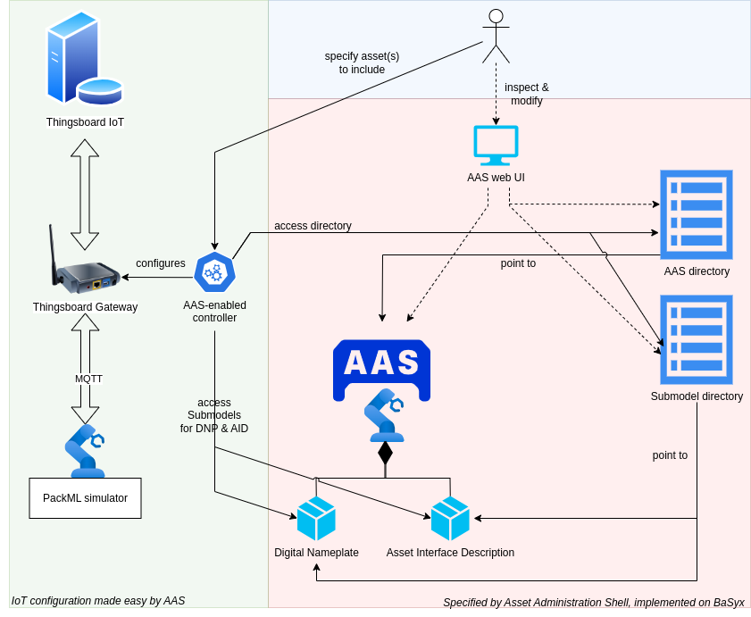

# AAS Hackaschool - example 2
This repository contains the cloud infrastructure used in the hackathon.
Additionally, it contains the IoT example configured by the Asset Interface Description discussed during session.
This repository is self-contained, meaning that you should be able to recreate the exercise at home after the event.

## Overview

In this example we configure a commercial off-the-shelf (COTS) tool, i.e. [Thingsboard](thingsboard.io), with information from one or several AASs.
For this purpose a small controller was written in Python, which continuously compares the Asset Interface Description with the running configuration in the thingsboard-gateway.
Upon changes the gateway configuration files are adjusted and the gateway software is restarted to activate the updated configuration.
Hereafter, the gateway software connects directly to the MQTT topics of the asset.

## Setup
This deployment uses multiple docker-compose files to somewhat separate the various products and concepts used.
If you are unfamiliar with Docker, please stick to the suggested commands and ask for help early.

### Docker
#### 1. Install `docker` and `docker compose`
* Install Docker, see https://docs.docker.com/desktop/

  Note: `docker compose` is required for the setup, please check that your distribution includes this application.
* On Linux, don't forget the postinstall: https://docs.docker.com/engine/install/linux-postinstall/
#### 2. Create our docker backend network
* Run `docker network create -d bridge ah-backend`

### Basyx
#### 1. `PUBLIC_IP` / `default.env`
* Please change the `PUBLIC_IP` variable in the `default.env` file to your public IP address.
  The AAS registry will advertise this IP-address later to clients, hence `localhost` does not work.
#### 2. Bring up the BaSyx services
* Run `docker compose -f docker-compose.basyx.yml --env-file default.env up -d`

### IoT Example
#### 1. Bring up the IoT services
* Run `docker compose -f docker-compose.iot.yml --env-file default.env up -d`

#### 2. Setup the gateway in Thingsboard
1. Open the Thingsboard web UI on `http://{PUBLIC_IP}:8080`, use username `tenant@thingsboard.org` and password `tenant`.
2. Navigate `Entities` -> `Devices`
3. Add a new device by clicking on the `+` in the top-right corner
4. Use name `hackaschool-gateway` and toggle the `Is gateway` to 'on'.
5. Click `Next: Credentials` (NOT `Add` yet)
6. Use access token `1234`
7. Click `Add` and then `Close` 

Note: If you open the device (by clicking on it) then you can inspect the `Last telemetry`, which is the telemetry of the gateway software.
After the gateway software starts there should be some entries shown here.
Similarly, when thingsboard adds the asset (after connection) there will be a new device with similar tabs.

### Postman
* Install the Postman tool to work with REST+JSON. 
* A so-called Postman collection (`AAS.postman_collection.json`) is supplied for your convenience to work with AASs. Basically it lists a few basic AAS REST calls with parameters and parses JSON return values.
* Import the collection into Postman.
* Please change the `IP_ADDR` variable to the same IP-address as `PUBLIC_IP` in the Basyx section.

## Running the example
Most of the configuration has already been done during the setup or has been pre-configured in the automation scripts.
The last remaining step is to upload the AASX describing the asset.

1. Open Postman
2. Select the `Upload AASX` POST call
3. Navigate to the `Body` tab
4. Select `form-data` and add a new key-value pair. Choose key `file`, select `File` from the dropdown and select the supplied AASX file `Spruik_AID.aasx`.
5. Click `Send` and you should get `true` in the `Response` box.

Please check if the AAS and Submodels have been added correctly in the registries and if they can be accessed.
Hint: Use the Postman collection and navigate in the JSON response.

Now data from the asset should be collected by the gateway and transferred to Thingsboard.
Open the Thingsboard web UI again and navigate to the devices to see if a new device was added.
Does the device also have telemetry data?

To restart the PackML simulator you can use the following commands:
1. Reset with mosquitto (MQTT client) `mosquitto_pub -h localhost -p 1884 -t "Site/Area/Line/Command/Reset" -m 1`
2. Start (after reset) with `mosquitto_pub -h localhost -p 1884 -t "Site/Area/Line/Command/Start" -m 1`

Note: You might need to change the `-h` parameter to point to the broker.
